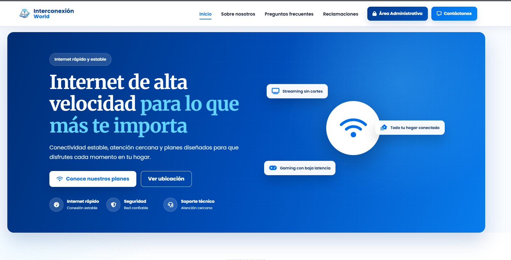
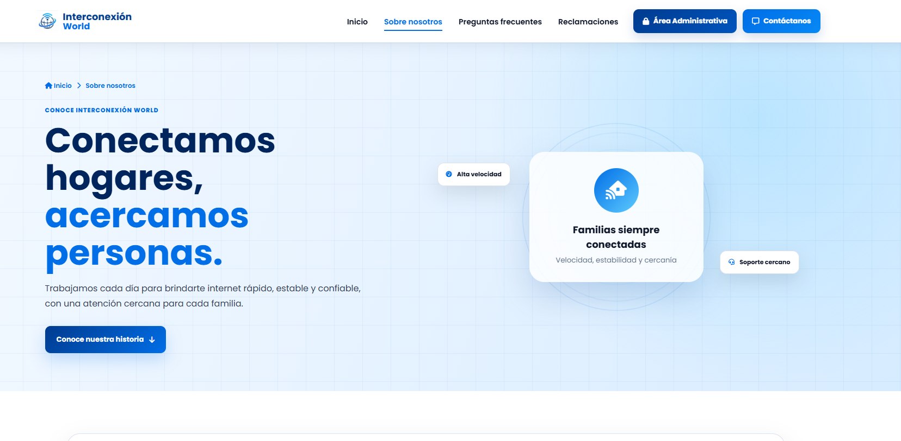
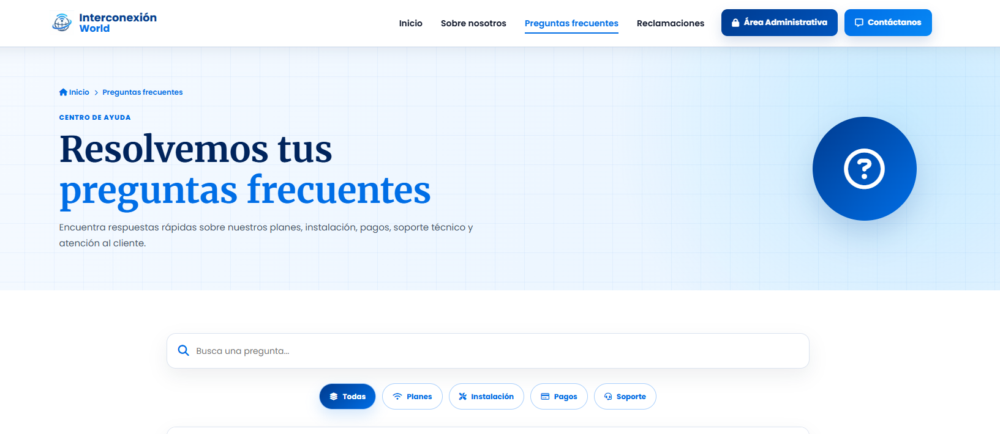
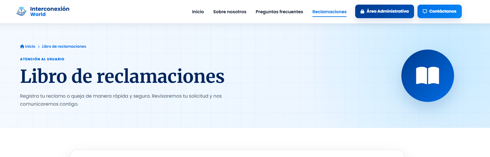

# 🌐 Interconexión World

<p align="center">
  
</p>

Sitio web desarrollado como proyecto de una empresa ficticia de servicios de internet. El objetivo fue crear una plataforma moderna donde los usuarios puedan conocer los planes disponibles, consultar la cobertura, resolver dudas frecuentes y registrar reclamos mediante un libro de reclamaciones.

<p align="center">

<a href="https://interconexion-world.vercel.app">

</a>

<a href="https://github.com/YersonPujay/interconexion-world">

</a>

</p>

---

# ✨ Funcionalidades

- ✅ Página de inicio moderna.
- ✅ Diseño responsive.
- ✅ Sección "Sobre nosotros".
- ✅ Preguntas frecuentes con buscador y filtros.
- ✅ Consulta de cobertura.
- ✅ Formulario de contacto.
- ✅ Libro de reclamaciones.
- ✅ Validaciones desarrolladas con JavaScript.

---

# 🛠 Tecnologías utilizadas

| Tecnología | Uso |
|------------|-----|
| HTML5 | Estructura del sitio |
| CSS3 | Diseño y estilos |
| JavaScript | Funcionalidad e interactividad |
| Git | Control de versiones |
| GitHub | Repositorio |
| Vercel | Despliegue |

---

# 📸 Capturas del proyecto

| Página principal | Sobre nosotros |
|------------------|----------------|
|  |  |

| Preguntas frecuentes | Libro de reclamaciones |
|----------------------|------------------------|
|  |  |

---

# 📁 Estructura del proyecto

```text
interconexion-world/
│
├── index.html
├── nosotros.html
├── preguntas.html
├── reclamaciones.html
│
├── assets/
│   ├── css/
│   ├── js/
│   └── images/
```

---

# 🎯 Objetivo

Desarrollar un sitio web moderno y funcional para representar a una empresa proveedora de internet, aplicando buenas prácticas de desarrollo web, diseño responsive y organización del código.

---

# 📱 Responsive

Compatible con:

- 💻 Computadoras
- 📱 Celulares
- 📲 Tablets

---

# 🌎 Estado del proyecto

🟢 **Activo**

El proyecto se encuentra desplegado en Vercel y disponible para su visualización.

---

# 👨‍💻 Autor

**Yerson Pujay**

- GitHub: https://github.com/YersonPujay
- LinkedIn: https://www.linkedin.com/in/yerson-pujay-0919bb247/

---
